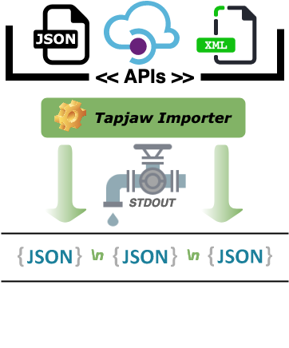

Tapjaw Importer - v2.0.0
=========================



Create a stream of payload messages to STDOUT from any API.

<!-- toc -->
- [Tapjaw Importer - v2.0.0](#tapjaw-importer---v200)
- [Description](#description)
- [Purpose](#purpose)
- [Why use Tapjaw Importer?](#why-use-tapjaw-importer)
- [Dependancies](#dependancies)
- [Setup a new project](#setup-a-new-project)
- [Components](#components)
  - [Commands](#commands)
  - [Adapters](#adapters)
  - [Configs](#configs)
  - [Connectors](#connectors)
  - [Contracts](#contracts)
    - [TapjawMessage](#tapjawmessage)
  - [Iterators](#iterators)
- [Examples & Tutorial](#examples--tutorial)
- [Changelog](#changelog)
  - [v2.0.0](#v200)
  - [v1.2.0 *(no longer supported)*](#v120-no-longer-supported)
  - [Previous versions](#previous-versions)
<!-- tocstop -->

# Description

Tapjaw Importer is a Typescript JSON-based utility framework purposefully designed to simplify the development of commands that chain together to consolidate data for persistence or further processing in the cloud or on your infrastructure.

The chained commands communicate with JSON over an STDIO stream using a pre-defined class called a `TapjawMessage`, containing some default metadata and payload properties, allowing for easy extending from the `TapjawMessage` Class based on the business rules of implementation.

The `TapjawMessage` schema enables the creation of a standardised streaming paradigm with JSON delimited by newlines, using the Unix pipe syntax, e.g.:-

```bash
$ bin/run apis my-network | bin/run filters remove-duplicates | bin/run stores s3 s3://my-bucket
```

In practice, you would use one API command in conjunction with multiple filter commands, finishing with a store command to persist the result in an external location. If you wish to output to various store commands, you can employ a Tools command to boot up multiple child processes and fan out to several store commands. Please refer to the example below for a pseudo-example:

```bash
$ bin/run apis my-network | bin/run filters remove-duplicates | bin/run filters clean | bin/run tools fan "stores s3 s3://my-bucket" "stores sqs sqs://sqs-server/my-queue"
```

The project provides several additional useful features to decrease the complexity of:
- Access HTTP/API endpoints with Connectors (`TapjawConnector` & `TapjawHttpConnector`).
  - Security implementations for Bearer, Basic and OAuth authentication.
- Iterate seamlessly over multiple pages of response data using Adapters (`TapjawAdapter`).
- Parser tools to convert XML or CSV to JSON (`xmlToJson` & `csvToJson`).
- Strong focus on Typescript data typing, employing contracted interfaces throughout the framework.
- Rate limiting of messages getting pushed through a stream from the API command.
- Each command type is has a base class designed for its purpose, meaning you only need to write a minimal amount of code.
- Date helper functions, providing a common toolkit that we've had to use in previous projects (using Luxon).
- A quick and simple .env configuration loading strategy (`DotEnvConfig`, *ref: `TapjawMessageConfig` for implementation*).
- Base `TapjawLogger` interface to allow easy implementation of your logging library. The project includes two basic implementations, `ConsoleLogger` and `NullLogger`, which `NullLogger` is generally used in testing.

# Purpose

Tapjaw Importer started life in 2019 due to a requirement of needing to import data from across dozens of APIs into a consistent internal schema,
each API has unique data schemas, various security infrastructures, request/response strategies and general differences in approach.

Tapjaw Importer's inspiration comes from the singer.io approach, which provides many API taps and targets. However, as an Affiliate Marketing company, we couldn't rely on singer.io to have all the APIs we needed. Instead, we created this framework that provides a more diverse approach to extracting data and doing something useful with it.

Tapjaw Importer provides a more abstract approach than singer.io by employing customisable API, filter, store and tool commands.

You as a developer can chain together as many commands as required as your business model sees fit in accomplishing the consolidation of data. You, as the developer, do not need to concern yourself with how data traverses through the commands.

We've successfully written and deployed four separate internal projects into production using this framework, allowing us to experience such a process's complexities. We've attempted to provide the necessary components to quickly set up your commands and data stream through this process.

# Why use Tapjaw Importer?

1. You use node.js with Typescript or Javascript.
2. Require a framework which allows you to quickly create API commands that streams each record to a STDOUT buffer.
3. Be able to quickly mix and match commands for your business purposes.
4. Slots in easily into existing system infrastructure.
5. The ability to create a custom toolkit of bespoke scalable commands.
6. Easy to implement data consolidation for cloud-based serverless projects.
7. An simple interface for creating streams of data between commands.

# Dependancies

- Node JS v16
- Commander.js
- reflect-metadata
- Typescript 4
- Unix based operating system (it might work in Windows, but no certainty can be provided)

# Setup a new project

Firstly, execute `cd` to your workspace or development directory.

```bash
~/workspace $> git clone "https://github.com/digidip/tapjaw-example.git#semver^2" my-project
```

> **Caution**: Please make sure you're using Node version 16. You may use [`nvm`](https://github.com/nvm-sh/nvm) for managing your node versions.

Now install all the frameworks dependencies. If you're not using node 16, you will get encounter an error.

```bash
~/workspace/my-project $> yarn install
```

Build the project with:

```bash
~/workspace/my-project $> yarn tsc
```

To validate the project, issue the following command:

```bash
~/workspace/my-project $> bin/run
```

You should see a similar output:

```bash
Usage: run [options] [command]

Options:
  -V, --version     output the version number
  -h, --help        display help for command

Commands:
  apis <api>        Execute an API command
  filters <filter>  Execute a filter command
  stores <store>    Execute a store command
  tools <tool>      Execute a tool command
  help [command]    display help for command
```

You are now ready to start working on your project. Refer to the `digidip/tapjaw-example`'s [README.md](https://github.com/digidip/tapjaw-example/blob/v2.0.0/README.md) for a tutorial on how to get get started.

# Components

An overview of each component available in Tapjaw Importer, focusing on each element with corresponding documentation in how to implement, extend and use correctly.

## Commands

Commands are the defined set of entrypoints in a project, commands consist of four distict types in Tapjaw Importer, each with a specific domain. Read the documentation links below to get an overview on how commands are configured and which command is used, for what purpose.

- [Commands overivew](docs/commands.md) - Overview of what is necessary to create a command.
- [API commands](docs/api-commands.md) - Pull data using connectors & adapters, converting each record into a `TapjawMessage` and write to the stdout stream.
- [Filter commands](docs/filter-commands.md) - Filter out stdin stream messages or forward messages to the stdout stream based on rules.
- [Store commands](docs/store-commands.md) - Persist incoming stdin messages to an external service, such as DBMS, s3 or a queue.
- [Tool commands](docs/tool-commands.md) - Additional commands which do not fit within the specification of the previous three categories, for example mutating a message.

## Adapters

Adapters are the agnostic link between an API command and a connector. The adapter implements the business logic on managing the responses from the connector and yields a `TapjawMessage` to the command to then be written to an output buffer.

Please refer to [Adapter documentation](./docs/adapters.md).

## Configs

By default Tapjaw Importer will use the `.env` ([dotenv](https://github.com/motdotla/dotenv)) approach towards configuration. Dotenv allows for creating a `.env` file in your project directory or the possibility to inject environment variables with an alternative method that your project can still read without a `.env` file. Ideally, you would use the `.env` approach during development and then use an external setter of environmental variables in production.

For more details please refer to [Configurations documentation](docs/configurations.md).

## Connectors

The purpose of a connector is to allow an adapter to use different external services. For example, some third party APIs will have a RESTful or SOAP API. The _Connector Pattern_ will enable us to create two implementations with identical method signatures for the adapter to use. The developer then chooses to switch between either connector and expect the adapter to operate seamlessly regardless of whichever connector is in use.

Please refer to [Connectors documentation](./docs/connectors.md).

## Contracts

The interfaces for Connectors, Adapters, Commands and Messages exist by default, and you can also extend from this directory for specifying types and interfaces for your project.

Please refer to [Contracts documentation](./docs/contracts.md).

### TapjawMessage

Each message (`TapjawMessage`) is composed of a payload without structural constraints, import date, identifier and a *sha256* signature generated from the Payload.

## Iterators

Tapjaw Iterators designed purpose is to iterate over the yielded messages provided by an Adapter and output each to an external interface. Tapjaw Importer tends to write to the [standard output](https://en.wikipedia.org/wiki/Standard_streams) (stdout) stream. You can override by extending the `OutputIterator` class or the `TapjawIterator` interface.

Please refer to [Iterators documentation](./docs/iterators.md).


Tapjaw Importer writes the STDOUT buffer due to the Unix feature of chaining of commands. In Unix derived systems, "piping" can be accomplished with the following example:

```bash
$ cat /etc/hosts | grep localhost
127.0.0.1       localhost digidip.local
::1             localhost
```

Tapjaw Importer provides two pre-implemented Iterators. Both are detailed before:-

# Examples & Tutorial

Reference the [Tapjaw Example v2.0](https://github.com/digidip/tapjaw-example/blob/v2.0.0) for an example on implementing a project.

# Changelog

The project employs the [semver](https://semver.org/) specification on versioning.

## v2.0.0
- Add date helper functions.
- Add standard Connector and Adapter errors.
- Typeguards.
- Update dependencies, ESLint and prettier.
- Add command contracts for APIs, Filters, Stores and Tools.
- Fix legacy typescript issues.
- Standardise the JSON parsing of `TapjawMessage`.
- Abstract streaming management in filter/store command contracts.
- Documentation.
- Implement the npm package publishing (#TODO).
- Implements reflect-metadata, added `@TapjawMetadata.Command.*` and `@TapjawMetadata.Connector.*` decorator methods for configuring commands and connectors, [read more](docs/commands.md#tapjaw-metadata-command-decorators).
- Renamed AdapterError to TapjawAdapterError (breaking change).

## v1.2.0 *(no longer supported)*
- Convert from OCLIF to Commander.js.
- Upgrade to Typescript 4.

## Previous versions
- The project was still in its infancy.
